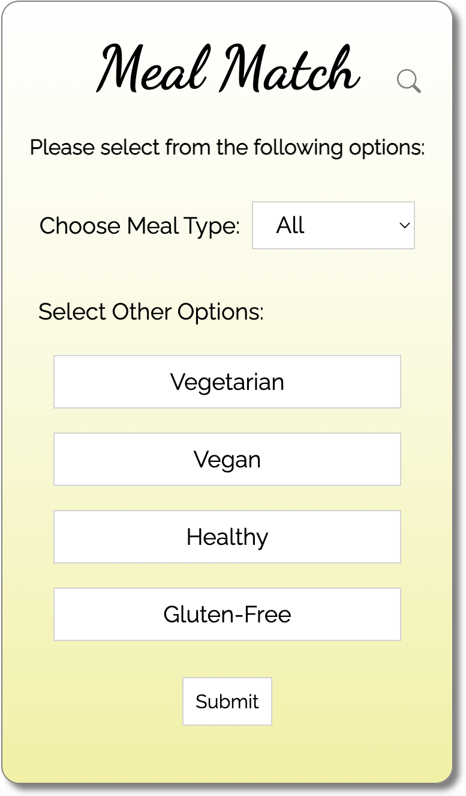

# Meal Match

A recipe app to match you with the meal of your dreams.

## Description

This project is a front-end recipe web application that allows users to "match" with their ideal meal or drink, much like a dating app. When a user opens the webpage, they will see a list of options to filter by the following:

1. Meal Type (Breakfast, Lunch, Dinner, Snacks, Desserts, Drinks)
2. Other Options (Vegetarian, Vegan, Healthy, Gluten-Free)

According to the options they choose, the user will be shown a meal where they can either "like" the meal with the smiley face or "dislike" the meal with the frowny face. 
- If they "dislike" the meal, they will see the next meal to "like" or "dislike". 
- If they "like" the meal, they will be taken to the recipe page with the ingredients and full instructions. 

If users do not want to filter their choices, they will be shown all the meals to "like" or "dislike".

If users would rather search, they can click the magnifying glass icon in the corner of the homepage. Users will be able to search by recipe name, meal type or ingredients.

## Usage

This project has been deployed at: https://ramitaarora.github.io/meal-match/

## Credits

This project was created by Ramita Indurkhya.